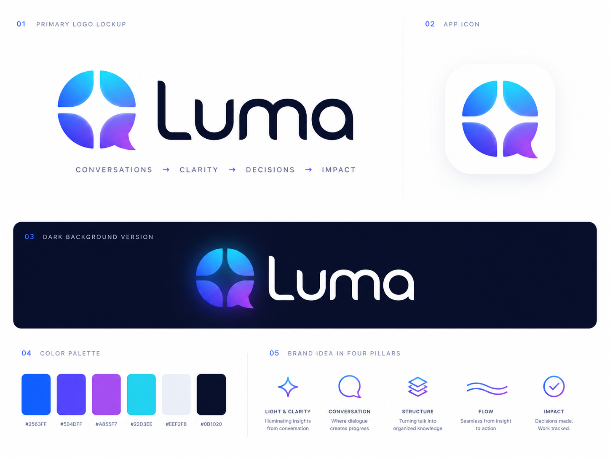

# Luma Brand

Luma is a Discord-native AI meeting intelligence product. The brand idea is conversations becoming clarity, decisions, and tracked impact.



## Palette

Use the CSS tokens in `assets/brand/luma-brand-tokens.css` as the source of truth:

| Token           | Hex       | Role                                                   |
| --------------- | --------- | ------------------------------------------------------ |
| `--luma-blue`   | `#2563FF` | Primary action and product identity.                   |
| `--luma-indigo` | `#5B4DFF` | Gradient depth and selected states.                    |
| `--luma-violet` | `#A855F7` | Insight, AI, and accent emphasis.                      |
| `--luma-cyan`   | `#22D3EE` | Clarity, highlights, and luminous starts of gradients. |
| `--luma-mist`   | `#EEF2F8` | Quiet backgrounds and app icon surfaces.               |
| `--luma-ink`    | `#0B1020` | Primary text and dark surfaces.                        |
| `--luma-slate`  | `#65708A` | Secondary text and supporting UI copy.                 |

The primary gradient is:

```css
var(--luma-gradient-primary)
```

## Logo Assets

| Asset                                     | Use                                                                             |
| ----------------------------------------- | ------------------------------------------------------------------------------- |
| `assets/brand/luma-logo-primary.svg`      | Default logo on light or mist backgrounds.                                      |
| `assets/brand/luma-logo-dark.svg`         | Dark presentation lockup where the ink surface is part of the asset.            |
| `assets/brand/luma-symbol-gradient.svg`   | Standalone brand symbol for app chrome, loading states, and compact placements. |
| `assets/brand/luma-symbol-mono-ink.svg`   | Single-color symbol on light backgrounds.                                       |
| `assets/brand/luma-symbol-mono-white.svg` | Single-color symbol on ink backgrounds.                                         |
| `assets/brand/luma-wordmark-ink.svg`      | Wordmark-only use when the symbol appears nearby.                               |
| `assets/brand/luma-app-icon.svg`          | Light app icon.                                                                 |
| `assets/brand/luma-app-icon-dark.svg`     | Dark app icon.                                                                  |

## Product UI Guidance

- Prefer `--luma-ink` for primary text and dark surfaces instead of raw black.
- Prefer `--luma-mist` for soft product backgrounds.
- Use the gradient for brand moments, icons, focus highlights, and important accents rather than as a generic page background.
- Keep operational interfaces calm and dense; let the Luma symbol, tokens, and small accents carry the brand.
- For Discord-facing surfaces, avoid color-only meaning. Pair status color with text, icon, or state structure.

## Brand Pillars

- Light and clarity: illuminating insights from conversation.
- Conversation: where dialogue creates progress.
- Structure: turning talk into organized knowledge.
- Flow: seamless from insight to action.
- Impact: decisions made and work tracked.
